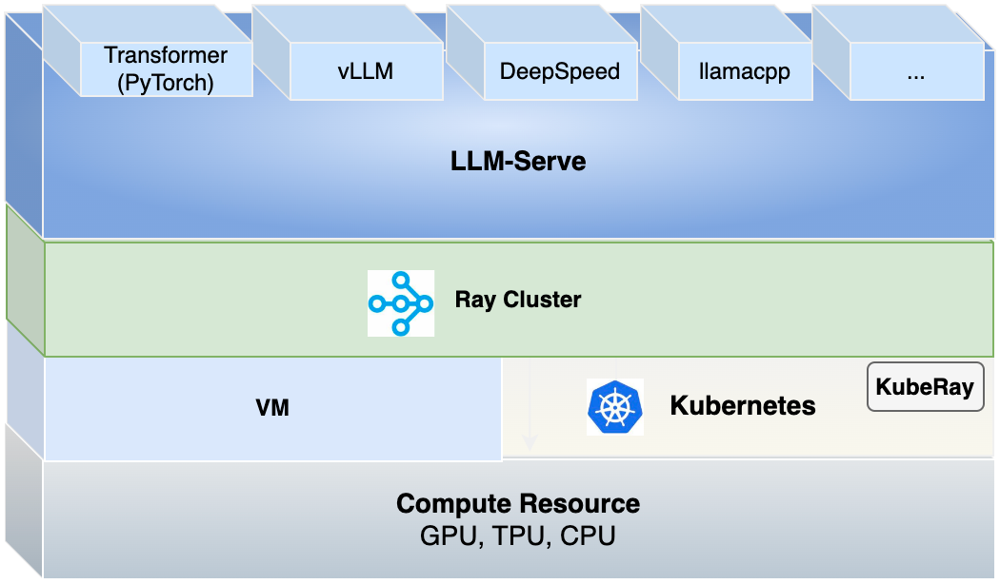

# LLM Inference - Quickly Deploy Productive LLM Service

`LLM Inference` is a large language model serving solution for deploying productive LLM services.

We gained a great deal of inspiration and motivation from [this open source project](https://github.com/ray-project/ray-llm). We are incredibly grateful to them for providing us with the chance to further explore and innovate by standing on the shoulders of giants.



With this solution, you can:

- Rapidly deploy various LLMs on CPU/GPU.
- Deploy LLMs on multiple nodes through Ray cluster.
- Speed up inference by using vLLM engine to build LLM inference.
- Utilize Restful API to manage inference of model.
- Customize model deployment by YAML.
- Compare model inferences.

More features in [Roadmap](./Roadmap.md) are coming soon.

## Getting started

### Deploy locally

#### Install `LLM Inference` and dependencies

You can start by cloning the repository and pip install `llm-serve`. It is recommended to deploy `llm-serve` with Python 3.10+.

```
git clone https://git-devops.opencsg.com/product/starnet/llm-inference.git
cd llm-inference
pip install .
```

Option to use another pip source for faster transfer if needed.

```
pip install . -i https://pypi.tuna.tsinghua.edu.cn/simple/
```

Install specified dependencies by components:

```
pip install '.[backend]'
pip install '.[frontend]'
```

**Note:** Install vllm dependency if runtime supports GPUs, run the following command:

```
pip install '.[vllm]'
```

Option to use other pip sources for faster transfers if needed.

```
pip install '.[backend]' -i https://pypi.tuna.tsinghua.edu.cn/simple/
pip install '.[frontend]' -i https://pypi.tuna.tsinghua.edu.cn/simple/
pip install '.[vllm]' -i https://pypi.tuna.tsinghua.edu.cn/simple/
```

#### Install Ray and start a Ray Cluster locally

Pip install Ray:

```
pip install -U "ray[serve-grpc]==2.8.0"
```

Option to use another pip source for faster transfer if needed.

```
pip install -U "ray[serve-grpc]==2.8.0" -i https://pypi.tuna.tsinghua.edu.cn/simple/
```

> **Note:** ChatGLM2-6b requires transformers<=4.33.3, while the latest vllm requires transformers>=4.36.0.

Start cluster then:

```
ray start --head --port=6379 --dashboard-host=0.0.0.0 --dashboard-port=8265
```

See reference [here](https://docs.ray.io/en/releases-2.8.0/ray-overview/installation.html).

#### Quick start

You can follow the [quick start](./docs/quick_start.md) to run an end-to-end case for model serving.

#### Uninstall

Uninstall `llm-serve` package:

```
pip uninstall llm-serve
```

Then shutdown the `Ray` cluster:

```
ray stop
```

### API server

See the [guide](./docs/api_server.md) for API server and API documents.

### Deploy on bare metal

See the [guide](./docs/deploy_on_bare_metal.md) to deploy on bare metal.

### Deploy on kubernetes

See the [guide](./docs/deploy_on_kubernetes.md) to deploy on kubernetes.

## FAQ

### How to use model from local path or git server or S3 storage

See the [guide](./docs/git_server_s3_storage.md) for how to use model from local path or git server or S3 storage.

### How to add new models using LLMServe Model Registry

LLMServe allows you to easily add new models by adding a single configuration file.
To learn more about how to customize or add new models, see the [LLMServe Model Registry](./models/README.md).

### Common Issues

See the [document](./docs/common_issues.md) for some common issues.
